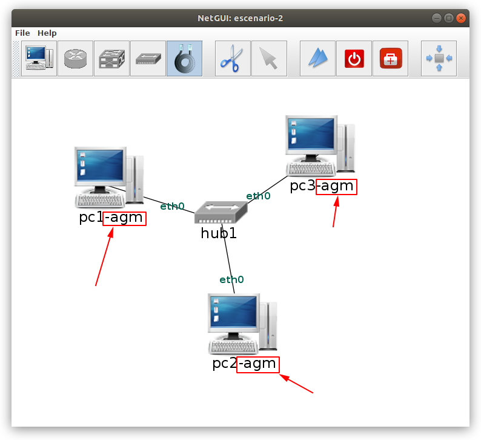
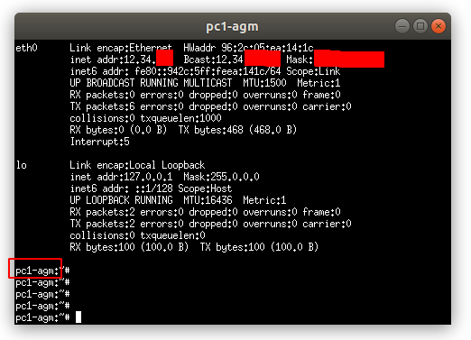
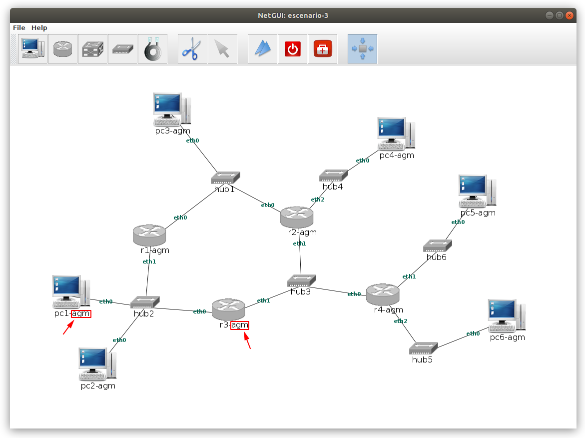

# Bloque II: Entrega de ejercicios

## Parte I: Protocolos y Ethernet

**Abre** el fichero de captura [captura1.cap](caputra1) con [wireshark](https://www.wireshark.org/) y **responde** a las siguientes preguntas:

1. ¿Cuantas tramas se han capturado en total?  
54

2. Accede a la trama capturada a los **184.088902** segundos. Indica qué **protocolos**
se usan y a **qué nivel** de la **arquitectura TCP/IP** corresponden

* HTTP: Nivel de aplicación  
* TCP: Nivel de transporte  
* IP: Nivel de Internet  
*  Ethernet: Nivel físico  

3. Seguimos con la misma trama anterior, capturada a los **184.088902** segundos y
responde a las siguientes preguntas:   
* 3.1: ¿Cuantos bytes se envía por el cable físico? (Sin contar el preámbulo y el CRC)  
  171  
* 3.2. ¿Y contando el CRC?  
171 + 4  
* 3.3. ¿Cuantos bytes tiene la cabecera del protocolo Ethernet?  
14  

* 3.4. ¿Cuántos bytes tiene la cabecera del protocolo IP? (si lo usa)  
20  

* 3.5. ¿Cuántos bytes tiene la cabecera del protocolo TCP? (si lo usa)  
32

* 3.6. ¿Cuántos bytes tiene la parte del protocolo HTTP? (si lo usa)  
105

4. Usando la misma trama anterior, responde las siguientes preguntas:  

  *  4.1: ¿Cuál es la dirección física de la máquina que recibe la trama?  
c2:84:5a:5a:13:55   
  * 4.2: ¿Cuá es la dirección física de la máquina que envía la trama?  
3e:ec:48:f5:60:02   

* 4.3: ¿Cuál es el valor del campo *Type* de esta trama ethernet?  
0x8000  

5. Analiza todas las tramas y escribe todos los protocolos diferentes que veas que se  
están usando, y clasifícalos segun  niveles según la **arquitectura TCP/IP**  

* Nivel físico: A nivel físico todas las tramas son Ethernet II  
* Nivel de internet: ARP, ICMP, IP,   
* Transporte: UDP, TCP  
* Aplicación: HTTP  

6. Analiza la trama número 32.

* 6.1: ¿Cuántos dato útiles (bytes) se transportan en el protocolo  
de último nivel?
* 6.2: ¿Qué mensaje se está enviando?  
hola\n  

## Parte II: Direcciones IP

1. Arranca **Netgui** y construye esta **subred** formada por 3 PC. **IMPORTANTE**:  
El **nombre de los PCs** debe debe terminar con un **guión** seguido de **tus iniciales**.  
Así, un estudiante que se llame *Antonio González Márquez* deberá añadir el sufijo *-agm*  
a los nombres de los PCs:

Toma un pantallazo del escenario y adjúntalo como respuesta a esta pregunta

2. **Configura** las direcciones IP de las **tres máquinas** para que pertecezcan a la  
misma subred. **IMPORTANTE**: El primer byte de todas las IP debe estar formado  
por los **dos primeros dígitos de tu DNI**, y el segundo byte por los dos siguientes.  El resto  
de bytes y la máscara de subred puede ser las que tú elijas, pero compatibles con que los
ordenadores pertenezcan a la misma subred. Por ejemplo, si el DNI de Antonio González Márquez es  
12345678W, las direcciones IP debe ser de la forma 12.34.x.x  

Rellena esta tabla con la información, y configura los pcs para que tengan esas direcciones IP  

| Nombre PC  |  Dirección IP  |
|------------|----------------|
|  pc1-xxx   |                |
|  pc2-xxx   |                |
|  pc3-xxx   |                |

| Nombre PC  |  Dirección IP  |
|------------|----------------|
|  pc1-agm   |  12.34.0.1     |
|  pc2-agm   |  12.34.0.2     |
|  pc3-agm   |  12.34.0.3     |

3. Completa esta tabla indicando los comandos que has empleado para configurar cada máquina  

|  PC        |  Comando |
|------------|----------|
|  pc1-xxx   |          |
|  pc2-xxx   |          |
|  pc3-xxx   |          |

|  PC        |  Comando |
|------------|----------|
|  pc1-xxx   | ifconfig eth0 12.34.0.1 netmask 255.255.255.0         |
|  pc2-xxx   | ifconfig eth0 12.34.0.2 netmask 255.255.255.0         |
|  pc3-xxx   | ifconfig eth0 12.34.0.3 netmask 255.255.255.0        |

3. Comprobación de las direcciones IP: Deberás usar el comando necesario para que  
aparezca en el terminal la **informaión de la configuracińo** de cada PC. Adjunta  
**un pantallazo** de **cada terminal**, con esa información. Para el ejemplo de nuestro  
estudiante Antonio González Márquez, la información de configuración del PC1 sería así:  

(Se ha eliminado la información importante)

4. Comprueba efectivamente que hay conectividad entre la máquina PC1 y PC2
* ¿Qué comando usas para ello?  
ping
* Crea un **pantallazo** de la terminal mostrando que efectivamente hay conectividad

5. Sitúate en **PC3** e inicia la **captura el tráfico** que hay en la red. El resultado se almacenará en un
fichero llamado **captura1-xxx.cap** donde xxx es el sufijo que has usado anteriormente con tus  
iniciales. Escribe el **comando completo** que has usado para realizar la captura:  
tcpdump -i eth0 -s 0 -w /hosthome/captura1-agm.cap

6. Desde PC1 usa el comando ping contra PC2, para que le envíe 3 mensajes, y termina la captura del tráfico. Muestra un pantallazo del terminal de PC1 con los resultados del comando ping

7. Abre con **wireshark** la captura que has realizado y saca un **pantallazo** donde se vean claramente  
todos los paquetes que han circulado por la subred

## Parte III: Enrutamiento

1. Arranca **Netgui** y crea un **escenario** como el que se muestra en esta imagen, usando la nomenclatura  definida en la parte anterior: añade a **cada PC** un **sufijo con tus iniciales**, y lo mismo para los **rúters**.  En el caso de nuestro estudiante Antonio González Márquez, el escenario quedaría así:

**IMPORTANTE**: Respeta la numeración tanto en los PCs como en los Rúters (en indiferenet en los hubs)

Obtén un **pantallazo** de tu escenario

2. ¿Cuantas subredes hay en este escenario?  
6

3. Crea una **tabla** las **direcciones IP de las subredes** y sus **máscaras**. Define las que tu quieras, PERO  
deben cumplir con la misma **restricción** que en la parte II: debes usar los **4 primeros dígitos** de tu **DNI**
para los 2 primeros bytes de las IP. Así, para el caso del estudiante Antonio González Márquez, todas
las IP comienzan por 12.34.x.x

| Dirección de subred | Máscara de subred |
|---------------------|-------------------|
|    ...              |  ...              |
|    ....             |  .....            |  

| Dirección de subred | Máscara de subred |
|---------------------|-------------------|
| 12.34.1.0           | 255.255.255.0     |
| 12.34.2.0           | 255.255.255.0     |
| 12.34.3.0           | 255.255.255.0     |
| 12.34.4.0           | 255.255.255.0     |
| 12.34.5.0           | 255.255.255.0     |
| 12.34.6.0           | 255.255.255.0     |

4. Asigna a todas las interfaces de los PCs y los rúters una dirección IP. Escríbelo
en la siguiente tabla:

| Nombre máquina | IP  | Interfaz |
|----------------|-----|----------|
| pc1-xxx        |     | eth0     |
| pc2-xxx        |     | eth0     |
| pc3-xxx        |     | eth0     |
| pc4-xxx        |     | eth0     |
| pc5-xxx        |     | eth0     |
| pc6-xxx        |     | eth0     |
| r1-xxx         |     | eth0     |
| r1-xxx         |     | eth1     |
| r2-xxx         |     | eth0     |
| r2-xxx         |     | eth1     |
| r2-xxx         |     | eth2     |
| r3-xxx         |     | eth0     |
| r3-xxx         |     | eth1     |
| r4-xxx         |     | eth0     |
| r4-xxx         |     | eth1     |
| r4-xxx         |     | eth2     |

| Nombre máquina | IP  | Interfaz |
|----------------|-----|----------|
| pc1-agm        | 12.34.2.1    | eth0     |
| pc2-agm        | 12.34.2.2    | eth0     |
| pc3-agm        | 12.34.1.3    | eth0     |
| pc4-agm        | 12.34.4.4    | eth0     |
| pc5-agm        | 12.34.6.5    | eth0     |
| pc6-agm        | 12.34.5.6    | eth0     |
| r1-agm         | 12.34.1.11   | eth0     |
| r1-agm         | 12.34.2.11   | eth1     |
| r2-agm         | 12.34.1.12   | eth0     |
| r2-agm         | 12.34.3.12   | eth1     |
| r2-agm         | 12.34.4.12   | eth2     |
| r3-agm         | 12.34.2.13   | eth0     |
| r3-agm         | 12.34.3.13   | eth1     |
| r4-agm         | 12.34.3.14   | eth0     |
| r4-agm         | 12.34.5.14   | eth1     |
| r4-agm         | 12.34.6.14   | eth2     |

5. Para configurar las direcciones IP de forma persistente, ¿Qué fichero  
de configuración hay que usar?  

6. ¿Qué comando hay que utilizar para hacer que los cambios sean efectivos?

7. **Configura** de forma **persistente** las IPs de **TODAS** las máquinas,  
  tanto de los PCs como de los rúters. Escribe para cada máquina el **contenido  
  del fichero de configuración** (el indicado en la pregunta 5)

8. Una vez configuradas sólo las direcciones IP (todavía no están las tablas
  de enrutamiento), contesta a las siguientes preguntas:
  * 8.1: ¿Existe conectividad entre pc1 y pc2?
  si
  * 8.2: ¿Existe conectividad entre pc1 y pc6?
  no

9. **Configura** de forma **persistente** la **tabla de enrutamiento** de **pc1** para que se  
pueda conectar con **pc3** y que los paquetes destinados a máquinas de otras subredes  
vayan a través del **ruter r3**. Escribe el fichero de configuración

10. **Configura** de forma **persistente** la tabla de enrutamiento de **pc3** para que exista  
conectividad con pc1. Escribe el fichero de configuración

11. **Configura** las tablas de encaminamiento necesarias para que haya conectividad entre  
pc1 y pc6. Los paquetes de pc1 a pc6 deben seguir la ruta pc1 -> r1 -> r2 -> r4 -> p6  Y los
paquetes de pc6 a pc1 deben seguir esta otra: pc6 -> r4 -> r3 -> pc1. Escribe los ficheros de  
configuración de las máquinas que hayas modificado para lograrlo

12. Ejecuta el comando traceroute en pc1 con destino pc6. Toma un pantallazo del resultado

13. Ejecuta el comando traceroute en pc6 con destino pc1. Toma un pantallazo del resultado

14. Al ejecutar el traceroute anterior, ¿Se obtienen las IPs de los dos ruters intermdios?  
  En caso de que no sea así, ¿Qué modificación debes realizar para que sí aparezcan?

15. Lanza una captura de tráfico desde r2(eth1) en el fichero **captura2-xxx.cap** donde xxx es el  
sufijo con tus iniciales. Ejecuta el comando traceroute desde pc1 a pc6. Abre la captura con  
**wireshark** y responde a las siguientes preguntas:

  * 15.1: ¿Cuantos paquetes se han capturado?  
  9
  * 15.2: Indica cuál es el TTL de cada uno de ellos
  Tres con TTL=1, tres con TTL=2 y tres con TTL=3

## Recursos

https://github.com/Obijuan/URJC-Gsyc-2018-Arquitectura-Internet/wiki/Practica-1:-Ethernet
