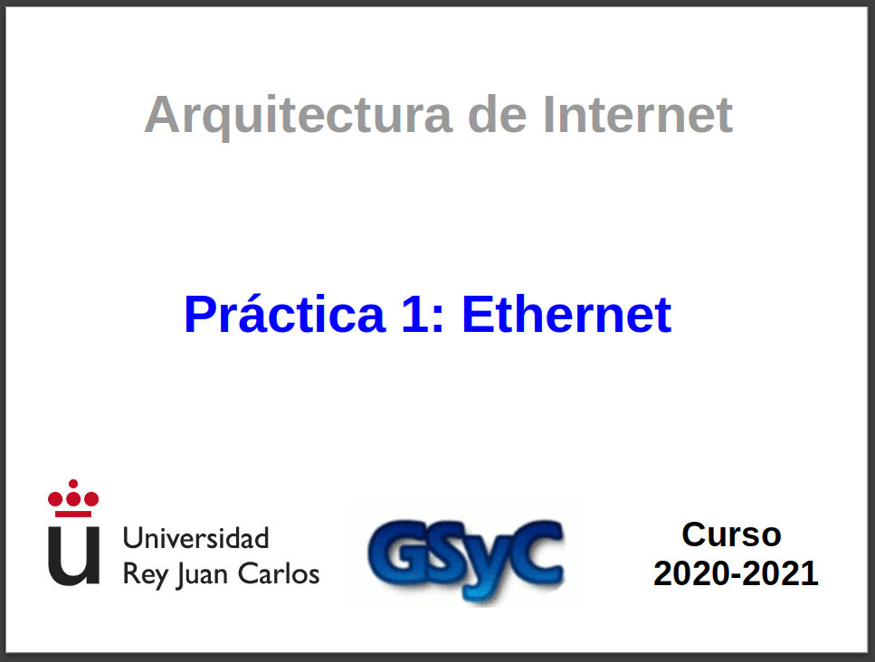
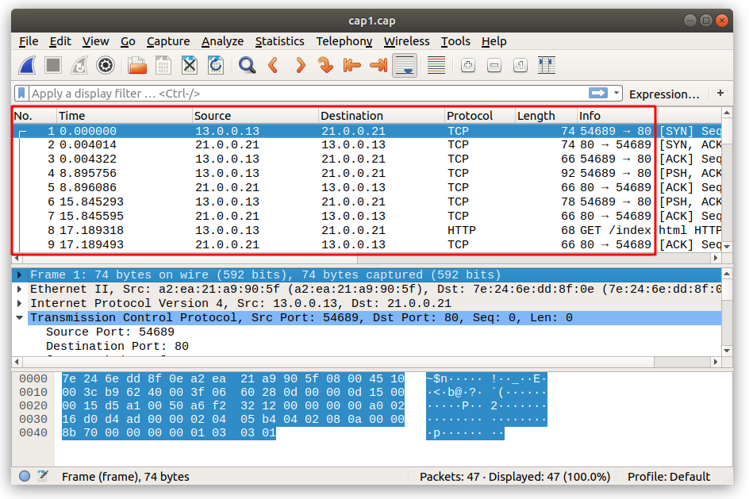
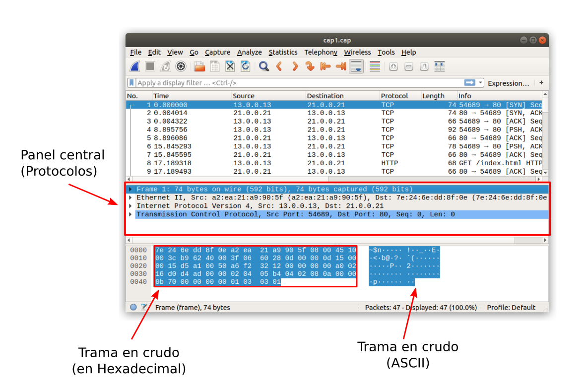
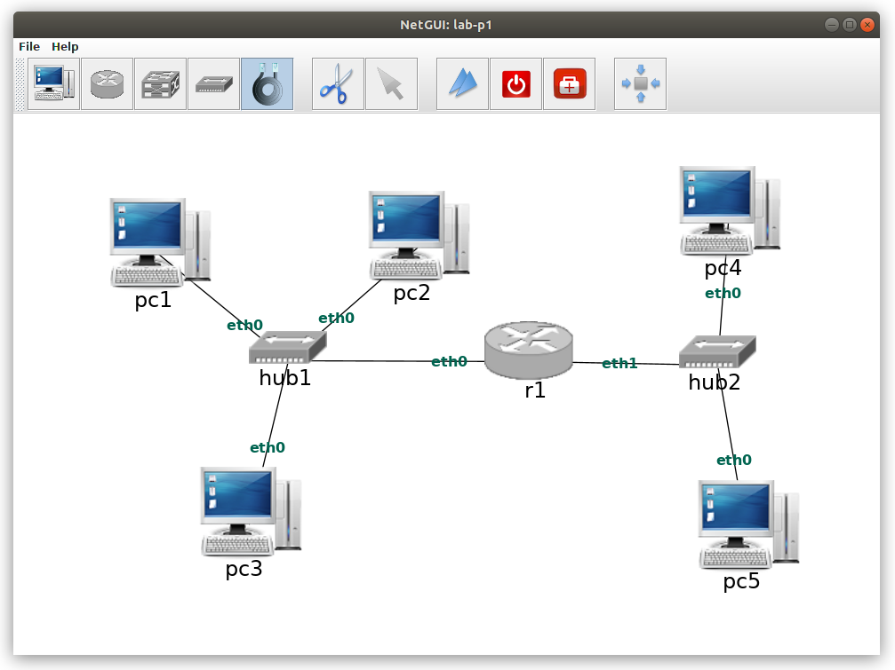

## Resumen

En esta práctica se mostrará el **encapsulamiento** entre unidades de datos de diferentes **protocolos** dentro de la **arquitectura TCP/IP**. Se dedicará especial atención al funcionamiento de **Ethernet**. Además se aprenderá a realizar capturas de tráfico con la herramienta **tcpdump**, y a analizarlas con la herramienta **wireshark**

**IMPORTANTE**: Toma nota de todo lo que hagas en un cuaderno de laboratorio, ya sea en papel o en formato electrónico. En él deberı́a constar lo que vas aprendiendo en cada apartado de la práctica, los pasos que has tenido que ir dando para obtener los resultados pedidos, los comandos que has empleado, las respuestas a las preguntas que se realizan en el enunciado, y cualquier otra información que consideres oportuna. Este cuaderno de laboratorio te será muy útil para repasar lo aprendido

## 1. Analisis de ficheros de captura de tráfico

### 1.1. Captura-1

**Abre** el fichero de captura [cap1.cap](https://github.com/Obijuan/URJC-Gsyc-2018-Arquitectura-Internet/raw/master/wiki/p1-ethernet/Download/cap1.cap) con [wireshark](https://www.wireshark.org/) y **responde** a las siguientes preguntas:

1. ¿Cuantas tramas se han capturado en total?

2. Pincha en la **trama 1**. Vamos a hacer un recordatorio de lo que significa cada campo, de izquierda a derecha




  * **No**: Número de trama según orden de captura. El **1** indica que esta ha sido la **primera trama** capturada

  * **Time**:  Tiempo en **segundos** que ha pasado desde que se capturó el primer paquete. Como es el primer paquete, su valor es **0** segundos. El segundo paquete muestra 0.004014 segundos. Significa que la trama 2 se ha capturado 4.014ms después de la primera

  * **Source**: Dirección origen del paquete. Esta dirección **depende del nivel**. En este caso muestra la dirección origen a **nivel de red** (Dirección IP). Pero en los ejemplos de la sesión anterior vimos cómo aquí se mostraba la **dirección física** (Ethernet)

  * **Destination**: Dirección destino del paquete. Esta dirección depende del nivel. En este caso muestra la dirección destino a **nivel de red** (Dirección IP)

  * **Protocol**: Protocolo de **más alto nivel** reconocido dentro del paquete

  * **Length**: Longitud total de la trama capturada, en **bytes**, **sin contar** el campo CRC (4 bytes). El campo CRC se queda a nivel físico. La tarjeta de red sólo devuelve al nivel superior las tramas recibidas correctamente, cuyo CRC es ok. Si fuese incorrecto, se descartan

  * **Info**: Resumen de la información más importante contenida en los **protocolos** reconocidos en el paquete

Con la **primera trama seleccionada**, observa en el panel central de **wireshark** los detalles de los protocolos para ese paquete. Indica qué protocolos se usan y a qué **nivel** de la **arquitectura TCP/IP** corresponden

3. En el **panel central** de wireshark se muestra información sobre los protocolos. En el **panel inferior** se puede ver la información de la **trama en crudo**: esos son todos los bytes que han pasado por el cable. Con la trama 1 seleccionada, pinchar en **Frame** en el panel central. En el panel inferio se selecciona todos los bytes que componen la trama. En este nivel no se muestra información sobre ningún protocolo, sólo de la trama en crudo ¿Cuantos bytes tiene la trama 1?



4. En el panel central, debajo de **Frame** vemos las **cabeceras** de los **protocolos reconocidos**, empezando por el de **menor nivel**: Ethernet y siguiendo con los de **niveles superiores**. ¿Cuántos bytes tiene la cabecera del protocolo **Ethernet** de la trama 1? ¿y los del protocolo **IP**? ¿Y los de **TCP**?

5. Con la **trama 1** seleccionada, despliga la pestaña del **protocolo Ethernet**. Indica qué campos observas en la **cabecera de Ethernet** y comprueba si la longitud de estos campos se corresponde con lo que hemos visto en la parte de teoría. Apunta los valores de los campos  


6. Pulsa sobre el campo *Type* de la **cabecera Ethernet** y observa cómo en la zona del Panel inferior se colorea dicho valor. Observa que wireshark interpreta el valor de **Type** 0x0800 como el código asociado al **protocolo IP**. ¿Qué significa que el valor del campo Type se corresponda con el código asociado al protocolo IP?

7. Observa que en las capturas **NO** aparece ni el **preámbulo**, ni el **comienzo de trama**. El hardware de la tarjeta Ethernet elimina estos campos, pues no forman parte propiamente de la trama Ethernet. Fı́jate en que tampoco aparece el **CRC**: el hardware de la tarjeta Ethernet comprueba que es correcto y lo elimina también de la trama. Si no fuera correcto descartarı́a la trama y no aparecerı́a en la captura.

8. Selecciona el **segundo paquete** y observa en el **Panel central** de *wireshark* los detalles de los **protocolos** para ese paquete. Indica qué protocolos se usan en ese segundo paquete y a **qué nivel** de la **arquitectura TCP/IP** corresponden dichos protocolos

9. Con el **segundo paquete** seleccionado, despliega la pestaña que se corresponde con el **protocolo Ethernet**. Indica qué **campos** observas en la **cabecera de Ethernet**. A la vista de los valores de estos campos indica si crees que este segundo paquete lo envı́a la misma máquina que envı́a el primer paquete

10. Fı́jate en la **longitud** del primer paquete que aparece en su columna Length del Panel 1. Dicha longitud hace referencia a la **longitud de toda la trama Ethernet** SIN el CRC. Para calcular la **longitud** de toda la trama Ethernet habrı́a que **sumar** a la columna Length de una trama los **4 bytes del CRC** que no aparecen en la trama capturada. ¿Crees que la primera trama lleva **bits de relleno** en Ethernet?

11. Si la columna **Length** de la trama tuviera un valor igual a **60 bytes** (longitud total de la trama igual a 64 bytes: 60 más 4 bytes del CRC) ¿podrı́as decir si dicha trama tiene o no relleno?

12. Observa el paquete **número 42**. Indica qué **protocolos** se usan en ese paquete y a qué **nivel** de la **arquitectura TCP/IP** corresponden

13. Observa el campo **longitud** de la **trama Ethernet** asociada al paquete número **18**. Si la máquina que está enviando esa información hubiese tenido más datos para enviar dentro de la trama 18, explica si hubiera podido incluirlos también en el **campo de datos** de dicha trama.

### 1.2. Captura-2

**Cierra** el fichero de captura *cap1.cap* y **abre** el fichero de captura [cap2.cap](https://github.com/Obijuan/URJC-Gsyc-2018-Arquitectura-Internet/raw/master/wiki/p1-ethernet/Download/cap2.cap) con **Wireshark** y **responde** a las siguientes preguntas:

1. Teniendo seleccionado el **primer paquete** de la captura, despliega la pestaña que se corresponde con el **protocolo Ethernet**. Indica qué **campos** observas en Ethernet. Apunta los valores de estos campos

2. Fı́jate en el campo *Type*. El valor es diferente al que viste en el fichero de captura anterior. ¿A qué protocolo se refiere este valor?

3. ¿Qué significa el valor del campo **dirección destino Ethernet** que aparece en ese primer paquete?

4. Fı́jate en el campo **longitud** de la primera trama. ¿Cuánto es la **longitud total** de la trama contando el **CRC**?

5. En este caso, el paquete es un mensaje del **protocolo ARP** que va encapsulado dentro de **Ethernet**. Todos los mensajes del protocolo ARP tienen la misma longitud, **28 bytes**. La cabecera de Ethernet ocupa **14 bytes** y el **CRC** 4 bytes. Por tanto la longitud total de la trama serı́a **46 bytes** y será necesario introducir **relleno** para alcanzar la longitud de **trama mı́nima** en Ethernet (64 bytes). El relleno deberı́a ser **18 bytes**

6. Observa para este paquete el **campo Padding**. ¿Qué longitud tiene? ¿Qué crees que significa este campo?


## 2. Generación de tráfico Ethernet y análisis de la captura de tráfico

Descarga este **escenario de red** para **NetGUI**: [lab-p1.zip](https://github.com/Obijuan/URJC-Gsyc-2018-Arquitectura-Internet/raw/master/wiki/p1-ethernet/Download/lab-p1.zip). Descomprímelo dentro de la **carpeta AI/P1**. Se te creará un nuevo directorio llamado **lab-p1**

**Arranca NetGUI** y desde al opción **File/Open** abre la carpeta **lab-p1**. Se te cargará un **escenario** que tiene sólo un ordenador: pc1. **Añade** el resto de elementos que se muestran en este **diagrama** (usando exactamente los mismos nombres)



**No arranques** ninguna máquina hasta que no termines de hacer el dibujo. **Guárdalo** (File/Save)

Este escenario **ya está configurado**, de forma que al arrancar las máquinas, se podrán comunicar entre ellas. En las siguientes prácticas aprenderemos a realizar esta configuración nosotros, pero para esta práctica partiremos de uno ya configurado

**Arranca** cada uno de los PCs y el **router**, de uno en uno, esperando que termine de arrancar una máquina para arrancar la siguiente. Observarás que el icono de las máquinas aparece ahora con **dos triángulos azules**, que indican que las máquinas están **ejecutándose**. Al arrancar las máquinas se **configuran** con una **dirección de nivel de red**, una **dirección IP**. El protocolo IP será objeto de estudio del tema siguiente.

1. Consulta las **direcciones Ethernet** que hay configuradas en cada una de las **interfaces** de las máquinas. Para ello ejecuta el comando **ifconfig**. Ten en cuenta que en **r1** tiene dos interfaces: **eth0** y **eth1**. Apunta las **direcciones Ethernet** de cada **interfaz** y dispositivo.

2. **Inicia** una captura en pc3 y otra en pc4. Para ello ejecuta los siguientes comandos

En **pc3**:

```
pc3:~# tcpdump -i eth0 -s 0 -w /hosthome/pc3.cap
```

En **pc4:**

```
pc4:~# tcpdump -i eth0 -s 0 -w /hosthome/pc4.cap
```

Ahora vas a **generar tráfico** de la siguiente forma: **pc1** va a enviar una **trama Ethernet** a **pc2** y pc2 va a responder. Para ello **ejecuta en pc1**:

```
pc1:~# arping -c 1 00:07:e9:22:22:22
```

Donde:

* La **dirección Ethernet** que estamos utilizando (00:07:e9:22:22:22) es la **dirección Ethernet** destinataria de las tramas, en este caso la de **pc2**.

* La opción -c 1 hace que *arping* envı́e un **único paquete** a la máquina pc2 y que ésta le responda

Interrumpe las capturas pulsando *Ctrl+C* en cada una de las ventanas de **pc3** y **pc4**

**Analiza** las **tramas Ethernet** que aparecen en ambas capturas. Para cada paquete indica:
(a) Dirección Ethernet origen  

(b) Dirección Ethernet destino  

(c) ¿Qué ocurre en la captura de pc4?  

(d) ¿Qué crees que se hubiera capturado en las interfaces de pc1(eth0), pc2(eth0), r1(eth0), r1(eth1) y
pc5(eth0) si hubiéramos arrancado también tcpdump en dichas interfaces? ¿Por qué?  

(e) Indica qué máquinas reciben la primera trama capturada y qué máquinas la procesan y se la entregan al
protocolo de nivel superior

(f) Indica qué máquinas reciben la segunda trama capturada y qué máquinas la procesan y se la entregan al
protocolo de nivel superior

(g) Si la primera trama llevara como dirección destino **ff:ff:ff:ff:ff:ff** indica qué máquinas recibirı́an dicha trama y qué máquinas se la entregarı́an al protocolo de nivel superior

3. Supón qué ocurrirı́a si se enviara una trama Ethernet de pc4 a pc5 y se capturara el tráfico en las siguientes
interfaces: pc1(eth0) y r1(eth1). Realiza la prueba y comprueba si tus suposiciones son ciertas

4. Supón qué ocurrirı́a si se enviara una trama Ethernet de pc1 a pc4 y se capturara el tráfico en pc2(eth0) y en
pc5(eth0). Realiza la prueba y comprueba si tus suposiciones son ciertas
